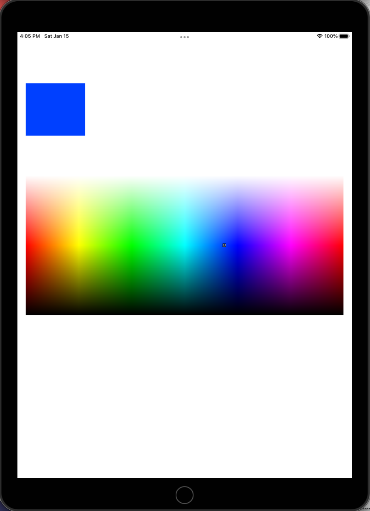

# iOSColorSpectrumView

Simple project containing a spectrum color selection view for iOS (Objective-C). 

You can select colors in the spectrum view with touches.

Spectrum view implements:

	@property (weak) IBOutlet id<ColorSpectrumViewDelegate>  delegate;
	
	-(void) setCurrentColorRed:(CGFloat) red green:(CGFloat) green blue:(CGFloat) blue;
	

Delegate of the spectrum view should implement: 

	@protocol ColorSpectrumViewDelegate
	-(void) pickedRed:(CGFloat) red green:(CGFloat) green blue:(CGFloat) blue;
	@end

to pick color selections.

The spectrum view is merely:

	luminance
	^
	|
	|
	|
	+----------------------------> hue 

This is a HSV color space visualization with saturation set to 1.0. 

Spectrum image is generated in `iOSSpectriumColorPicker/Spectrum/ColorSpectrumDrawer.m`

Touches and display is handled by `iOSSpectriumColorPicker/Spectrum/ColorSpectrumView.m`

